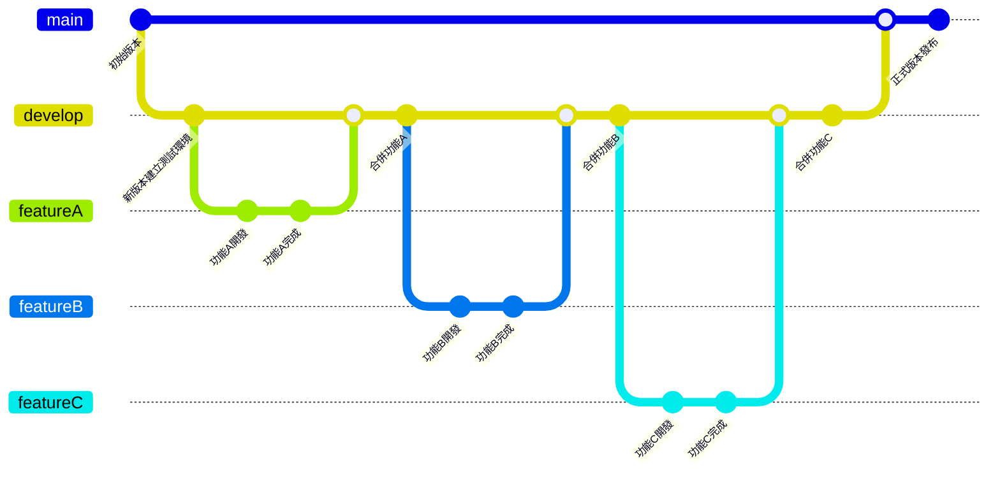

# ChinAn

## 專案總覽
本專案採前後端分離：前端使用 Vue 3 + Vite SPA，後端使用 .NET 8 Web API。
所有詳細架構、規範文件集中在 `AI-Construction/`，供快速查閱與一致開發規格。

---

## 子專案一覽（快速瀏覽）
| 專案 | 說明 | 主要技術 | README |
|---|---|---|---|
| WebApi | 提供各網頁資料存取 API 接口 | .NET 8 Web API、EF Core、MySQL | [API 專案總覽](AI-Construction/Api-Constructions/README.md) |
| UserWeb | 客戶端前台網站 | Vue 3 + Vite SPA | [前端專案總覽](AI-Construction/Vue3-Costructions/README.md) |
| EmpWeb | 員工/管理端網站 | Vue 3 + Vite SPA | [前端專案總覽](AI-Construction/Vue3-Costructions/README.md) |

---

## 架構文件快速入口
### 後端（.NET 8 Web API）
- 專案總覽：[後端 README](AI-Construction/Api-Constructions/README.md)
- 架構設計：[ARCHITECTURE](AI-Construction/Api-Constructions/ARCHITECTURE.md)
- API 規範：[API_GUIDELINES](AI-Construction/Api-Constructions/API_GUIDELINES.md)
- 程式撰寫規範：[CODING_GUIDELINES](AI-Construction/Api-Constructions/CODING_GUIDELINES.md)

### 前端（Vue 3 + Vite SPA）
- 專案總覽：[前端 README](AI-Construction/Vue3-Costructions/README.md)
- 架構設計：[ARCHITECTURE](AI-Construction/Vue3-Costructions/ARCHITECTURE.md)
- API Client：[API_CLIENT_GUIDE](AI-Construction/Vue3-Costructions/API_CLIENT_GUIDE.md)
- 程式撰寫規範：[CODING_GUIDELINES](AI-Construction/Vue3-Costructions/CODING_GUIDELINES.md)

---

## 環境連結
- WebApi Swagger（測試）：[Swagger](https://chinan-api-hzccg2bafue3fzba.canadacentral-01.azurewebsites.net/swagger/index.html)
- UserWeb（測試）：[Staging](https://proud-bush-036885100.1.azurestaticapps.net)
- EmpWeb（測試）：[Staging](https://white-bay-0b4cccf00.2.azurestaticapps.net)
- UserWeb（正式）：[Production](https://salmon-ocean-07c3a3b00.1.azurestaticapps.net)
- EmpWeb（正式）：[Production](https://white-dune-0f04a9600.1.azurestaticapps.net)

AP 主機 / DB 主機環境皆架設在 Azure，使用 Docker 容器化部署專案，並建立 PR Agent 協助檢查每次 PR，搭配 SonarQube 進行品質控管。

## 分支管理說明

針對以下三個分支的想法進行優化及整理：

1. **Main**：同步目前正式環境的運行程式。
2. **Develop**：代表測試環境。
3. **feature/功能名**：會有多個分支，分別讓不同人進行開發。

分支關係如下：
- Develop 建立版本後，拉出不同 feature 分支進行開發。
- 要進行正式機部署時，會將該版本的 Develop 合併至 Main 上。

### 分支關係圖

## 合併保護
[查看合併說明](MERGE_STRATEGY.md)
