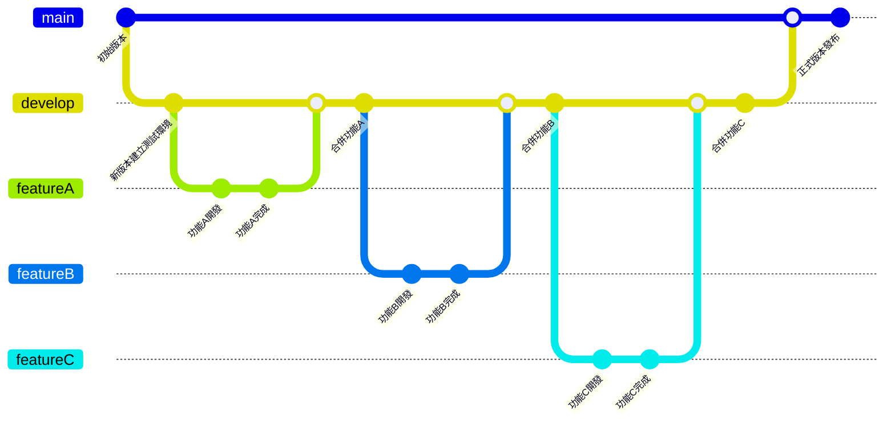

# ChinAn
  
## 專案架構

1. **WebApi**：提供各網頁資料存取 API 接口。
2. **UserWeb**：一個網頁，提供客戶顯示該車輛保養資訊。<https://salmon-ocean-07c3a3b00.1.azurestaticapps.net>
3. **EmpWeb**：一個網頁，提供員工或管理者維護各車輛資料。<https://white-dune-0f04a9600.1.azurestaticapps.net>

## 分支管理說明

針對以下三個分支的想法進行優化及整理：

1. **Main**：同步目前正式環境的運行程式。
2. **Develop**：代表測試環境。
3. **feature/功能名**：會有多個分支，分別讓不同人進行開發。

分支關係如下：
- Develop 建立版本後，拉出不同 feature 分支進行開發。
- 要進行正式機部署時，會將該版本的 Develop 合併至 Main 上。

### 分支關係圖

## 合併保護
[查看合併說明](MERGE_STRATEGY.md)
